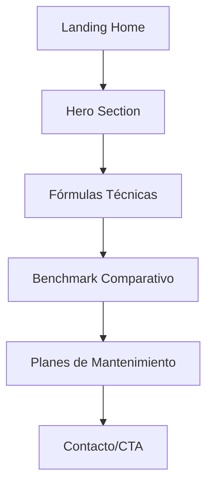

## 1. Product Overview
Landing page de propuesta comercial dirigida a los directivos de PharmaPlus para contratar el servicio de mantenimiento "Senior Architect". La página debe persuadir sobre la necesidad crítica de mantener su infraestructura headless de alto rendimiento.

- Problema a resolver: Convencer a PharmaPlus de la importancia de un mantenimiento especializado para su ecosistema digital complejo
- Usuario objetivo: Directivos y tomadores de decisiones de PharmaPlus
- Valor: Posicionar el servicio de mantenimiento como esencial para la continuidad operativa y crecimiento del negocio farmacéutico digital

## 2. Core Features

### 2.1 User Roles
| Role | Registration Method | Core Permissions |
|------|---------------------|------------------|
| Visitante | No requiere registro | Ver toda la información de la propuesta, planes de mantenimiento, comparativas |
| Cliente PharmaPlus | Contacto directo | Acceso a información adicional, agendamiento de reuniones |

### 2.2 Feature Module
Landing page de propuesta de mantenimiento consiste en las siguientes páginas:

1. **Home page**: Hero section con propuesta de valor, sección de fórmulas técnicas, comparativa de rendimiento, planes de mantenimiento, stack tecnológico visual, call-to-action de contacto.

### 2.3 Page Details
| Page Name | Module Name | Feature description |
|-----------|-------------|---------------------|
| Home page | Hero section | Mostrar headline "Manteniendo el Ecosistema Digital de PharmaPlus" con subhead "Infraestructura Headless de Alto Rendimiento: Next.js + Supabase + WooCommerce". Incluir animaciones super pro y glassmorphism |
| Home page | Fórmulas Técnicas | Exhibir las 4 fórmulas críticas: Buscador Inteligente (Supabase Sync), Logística de Última Milla (OrbisFarma & Cadena de Frío), Pagos Blindados (Credibanco/Wompi), Experiencia Farmacéutica (Pillbox, Captcha) |
| Home page | Benchmark Comparativo | Mostrar tabla comparativa con métricas de rendimiento: 0.8s vs 4.0s tiempo de carga, escalabilidad ilimitada vs 500 SKUs, control total de datos vs dependencia de proveedor |
| Home page | Planes de Mantenimiento | Presentar 3 planes: Soporte Vital (Correctivo/Monitoreo), Seguridad Total (Fee Mensual - Recomendado), Bajo Demanda (Bolsa de Horas) |
| Home page | Stack Tecnológico Visual | Mostrar logos de Next.js, Vercel, Supabase, Redis, WooCommerce con diseño light theme y glassmorphism |
| Home page | Call-to-Action | Botón prominente para contactar y agendar reunión con el Senior Architect |

## 3. Core Process
El flujo del visitante es simple y directo: llega a la landing, comprende la propuesta de valor específica para PharmaPlus, revisa las fórmulas técnicas que ya están implementadas, ve la comparativa de rendimiento, evalúa los planes de mantenimiento, y finalmente contacta al equipo.

## 4. User Interface Design

### 4.1 Design Style
- **Colores primarios**: Blanco (#FFFFFF) y azul farmacéutico profesional (#0066CC)
- **Colores secundarios**: Gris claro (#F8F9FA) y acentos en verde salud (#00AA44)
- **Botones**: Estilo glassmorphism con bordes redondeados y animaciones hover
- **Tipografía**: Inter o Roboto para headers, Open Sans para body text
- **Tamaños de fuente**: Headers 48-64px, body 16-18px, captions 14px
- **Layout**: Card-based con glassmorphism, espaciado generoso, animaciones super pro
- **Iconos**: Estilo lineal moderno, preferiblemente custom o de librería premium

### 4.2 Page Design Overview
| Page Name | Module Name | UI Elements |
|-----------|-------------|-------------|
| Home page | Hero section | Glassmorphism con blur de 20px, gradiente sutil azul-blanco, animación de partículas medicinales, tipografía bold de 64px para headline |
| Home page | Fórmulas Técnicas | Cards con glass effect, iconos custom de cada fórmula, hover animations con scale(1.05), color coding por categoría |
| Home page | Benchmark | Tabla comparativa con fondo glass, métricas destacadas en verde, animación de números contando |
| Home page | Planes | Pricing cards con glassmorphism, plan recomendado destacado con borde dorado, animación de pulse sutil |
| Home page | Tech Stack | Grid de logos con glass containers, hover effects con rotateY(10deg), blur sutil en background |

### 4.3 Responsiveness
Desktop-first approach con adaptación mobile. Los elementos glassmorphism se simplifican en móvil manteniendo la esencia visual. Touch optimization para todos los botones y cards interactivas.

### 4.4 Animations
- **Scroll-triggered animations**: Fade-in-up para secciones, slide-in para cards
- **Micro-interactions**: Hover effects en botones con scale y shadow, pulse en elementos importantes
- **Loading states**: Skeleton screens con glass effect para contenido dinámico
- **Transition timing**: 0.3s ease-out para hovers, 0.6s para scroll animations