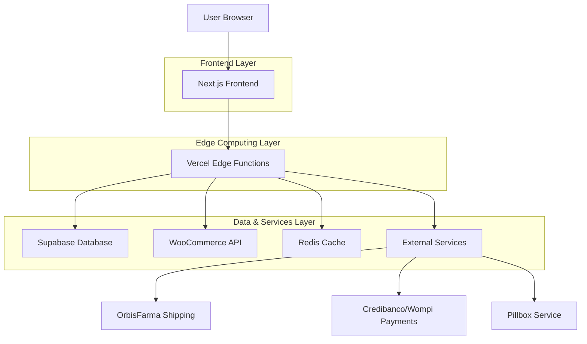

## 1. Architecture design



## 2. Technology Description

- **Frontend:** Next.js@14 + React@18 + TypeScript + TailwindCSS
- **Initialization Tool:** create-next-app
- **Backend:** Vercel Edge Functions + Supabase
- **Database:** Supabase (PostgreSQL)
- **Cache:** Redis (Upstash)
- **Commerce Engine:** WooCommerce REST API
- **Deployment:** Vercel with ISR (Incremental Static Regeneration)

## 3. Route definitions

| Route | Purpose |
|-------|---------|
| / | Landing page principal con toda la propuesta de mantenimiento |
| /api/contact | Endpoint para enviar formularios de contacto |
| /api/health | Health check para monitoreo del servicio |

## 4. Core Components & Services

### 4.1 Landing Page Components

Hero Section Component
```typescript
interface HeroProps {
  headline: string
  subheadline: string
  ctaButton: {
    text: string
    link: string
  }
}
```

Formula Card Component
```typescript
interface FormulaCardProps {
  title: string
  description: string
  icon: string
  category: 'search' | 'logistics' | 'payments' | 'experience'
  metrics?: {
    performance: string
    impact: string
  }
}
```

Pricing Plan Component
```typescript
interface PricingPlanProps {
  name: string
  price: string
  features: string[]
  isRecommended: boolean
  planType: 'vital' | 'total' | 'demand'
}
```

### 4.2 API Integration Points

**Supabase Integration:**
```typescript
// Real-time product search sync
const searchProducts = async (query: string) => {
  const { data, error } = await supabase
    .rpc('search_products', { search_query: query })
    .limit(20)
  return { data, error }
}
```

**WooCommerce Webhook Handler:**
```typescript
// Handle product updates from WooCommerce
const handleProductUpdate = async (webhook: WooWebhook) => {
  // Update Supabase products_search table
  // Invalidate Redis cache
  // Trigger ISR revalidation
}
```

## 5. Performance Optimization Strategy

### 5.1 Caching Layers
- **Redis Cache:** Product search results, session data, shipping calculations
- **Vercel Edge Cache:** Static assets, ISR pages
- **Browser Cache:** Images, fonts, static resources

### 5.2 Image Optimization
- Next.js Image component with automatic WebP conversion
- Responsive images with srcset
- Lazy loading for below-the-fold content

### 5.3 Bundle Optimization
- Dynamic imports for heavy components
- Tree shaking for unused code
- Code splitting by route

## 6. Security Implementation

### 6.1 API Security
- Rate limiting on all endpoints
- CORS configuration for allowed origins
- Input validation and sanitization
- Webhook signature verification for WooCommerce

### 6.2 Data Protection
- Environment variables for sensitive data
- HTTPS enforcement
- Secure headers configuration
- SQL injection prevention via Supabase prepared statements

## 7. Monitoring & Analytics

### 7.1 Performance Monitoring
- Vercel Analytics for Core Web Vitals
- Custom metrics for business KPIs
- Error tracking with Sentry integration
- Uptime monitoring with health checks

### 7.2 Business Metrics
- Conversion rate tracking
- User engagement metrics
- Plan comparison analytics
- Contact form submission rates

## 8. Deployment Strategy

### 8.1 CI/CD Pipeline
- GitHub Actions for automated deployment
- Preview deployments for PRs
- Staging environment for testing
- Production deployment with zero downtime

### 8.2 Environment Configuration
```bash
# Environment variables
NEXT_PUBLIC_SITE_URL=https://pharmaplus-maintenance.com
SUPABASE_URL=your_supabase_url
SUPABASE_ANON_KEY=your_supabase_anon_key
REDIS_URL=your_upstash_redis_url
WOOCOMMERCE_CONSUMER_KEY=your_wc_key
WOOCOMMERCE_CONSUMER_SECRET=your_wc_secret
```

## 9. Maintenance Architecture

The landing page itself requires minimal maintenance but serves as the entry point for the comprehensive maintenance service that includes:

- **Automated monitoring** of all integrated services
- **Proactive error detection** and resolution
- **Performance optimization** based on real metrics
- **Security updates** for all dependencies
- **Feature evolution** based on PharmaPlus growth needs

This architecture ensures the landing page loads in under 1 second while demonstrating the same level of technical excellence that PharmaPlus expects from their maintenance provider.